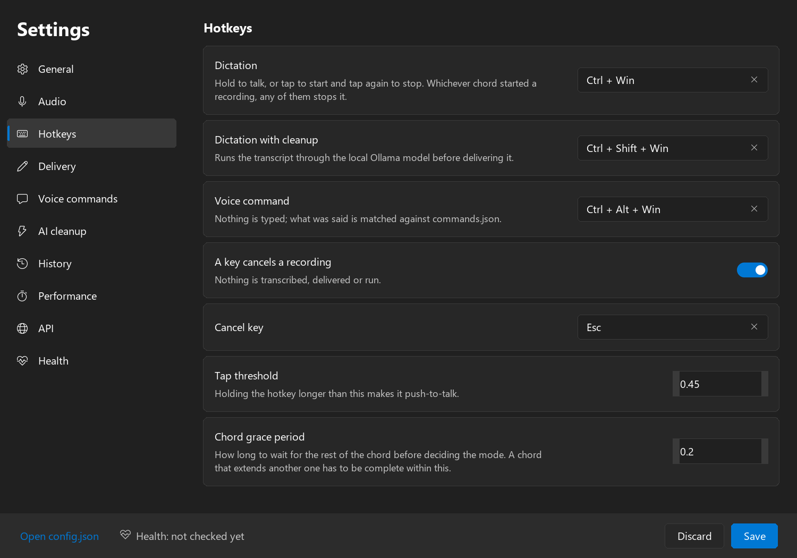
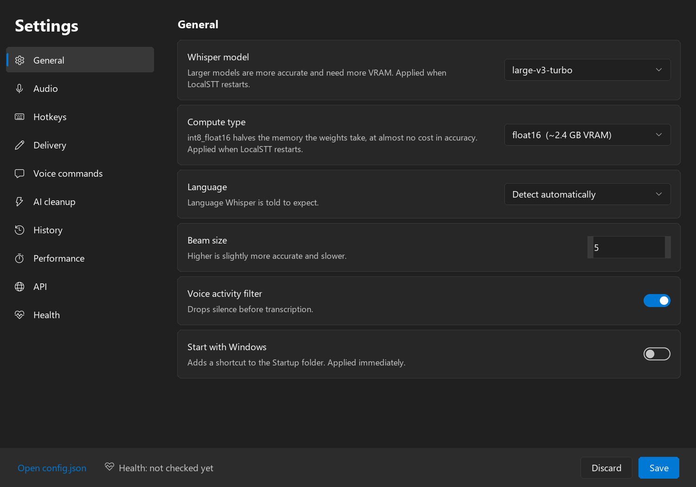
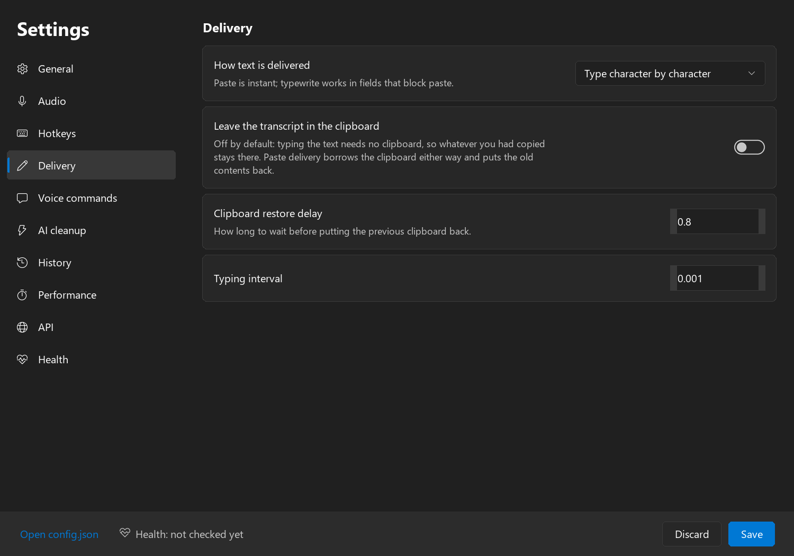

# LocalSTT

**Hold a hotkey, talk, let go — the text is typed where your cursor already is.**
Speech recognition that runs entirely on your own GPU, with a Windows 11 tray app,
an optional AI cleanup pass and an OpenAI-compatible HTTP endpoint.

Nothing is uploaded. No account, no API key, no network calls except the ones you ask
for — the model is downloaded once and everything after that is local.

[Русская версия](README.ru.md)



---

## Contents

- [What it does](#what-it-does)
- [System requirements](#system-requirements)
- [Install](#install)
- [Hotkeys](#hotkeys)
- [Settings](#settings)
- [Delivery and the clipboard](#delivery-and-the-clipboard)
- [Dictionary](#dictionary)
- [AI cleanup](#ai-cleanup)
- [Voice commands](#voice-commands)
- [HTTP API](#http-api)
- [Self-test and health](#self-test-and-health)
- [Autostart](#autostart)
- [Files and folders](#files-and-folders)
- [Dependencies](#dependencies)
- [Does it run on macOS or Linux?](#does-it-run-on-macos-or-linux)
- [Privacy](#privacy)
- [License](#license)

---

## What it does

| | |
| --- | --- |
| **Dictate anywhere** | Hold `Ctrl+Win`, talk, let go. The text goes into whatever field had focus — a browser, an IDE, a chat box, a terminal. Tap instead of hold to start, tap again to stop. |
| **Runs on your GPU** | [faster-whisper](https://github.com/SYSTRAN/faster-whisper) on CTranslate2, `large-v3-turbo` by default. Several times faster than real time on a modern card. |
| **AI cleanup** | `Ctrl+Shift+Win` sends the transcript through a local [Ollama](https://ollama.com) model first, which strips filler words and fixes punctuation without changing what you said. |
| **Voice commands** | `Ctrl+Alt+Win` matches what you said against `commands.json` and runs it. Nothing is typed. Only listed actions can run. |
| **Types or pastes** | Types character by character by default, which works in fields that block paste; switch to clipboard paste when you want speed. |
| **Rebindable** | Every hotkey is yours to change, from the settings window. Any key, not just modifiers. |
| **HTTP API** | An OpenAI-compatible `/v1/audio/transcriptions` endpoint on `127.0.0.1`, so other tools can use the same running model. |
| **Says what is wrong** | A self-test checks the driver, VRAM, CUDA DLLs, microphone and port, and says what to do about each failure instead of crashing later. |

---

## System requirements

| | Required | Notes |
| --- | --- | --- |
| **OS** | Windows 10 version 2004 (build 19041) or newer, 64-bit | Windows 11 is what it is developed against; the tray menu and settings window draw the Windows 11 look. |
| **GPU** | NVIDIA, compute capability 7.0 or newer (RTX 20-series, GTX 16-series, Volta and up) | **There is no CPU fallback.** LocalSTT refuses to start without a usable CUDA device, and says why. |
| **VRAM** | 4 GB free for the default model | See the table below. On a tight card, drop the compute type to `int8_float16`. |
| **Driver** | NVIDIA 527.41 or newer | What the CUDA 12 wheels need. No CUDA Toolkit installation is required — the wheels carry their own DLLs. |
| **Python** | 3.10 – 3.13, 64-bit | 3.12 is what it is built and tested against. The installer offers to install it for you if there isn't one, and finds an existing one whether or not it is on `PATH`. |
| **Disk** | ~4 GB | ~2.5 GB of Python packages, plus the model (1.6 GB for `large-v3-turbo`). |
| **Microphone** | Any input Windows can see | Picked in `Settings → Audio`, or left on the Windows default. |
| **Ollama** | Optional | Only for the AI cleanup hotkey. Everything else works without it. |

VRAM the model actually needs, measured with `beam_size 5` on a ~30 s window:

| Model | float16 | int8_float16 | int8 | Download |
| --- | --- | --- | --- | --- |
| `large-v3-turbo` (default) | 2.4 GB | 1.5 GB | 1.2 GB | 1.6 GB |
| `large-v3` | 3.2 GB | 1.9 GB | 1.6 GB | 3.1 GB |
| `medium` | 1.8 GB | 1.1 GB | 0.9 GB | 1.5 GB |
| `small` | 0.9 GB | 0.6 GB | 0.5 GB | 0.5 GB |

Cleanup runs an Ollama model on the same card, so it has to fit in what is left over.
`Settings → AI cleanup` works out what fits and offers to download it.

---

## Install

```powershell
git clone https://github.com/iFrosta/localSTT.git
cd localSTT
.\install.ps1
```

That is the whole thing. The installer stays inside the folder it is run from:

1. checks Windows, Python and the GPU — and offers to install Python with `winget`
   if there is none,
2. creates `.venv` next to itself,
3. installs the tested dependency set (`-Latest` installs the newest instead),
4. installs the cuBLAS and cuDNN wheels — no CUDA Toolkit needed,
5. writes `%APPDATA%\LocalSTT\config.json` if there isn't one,
6. runs the self-test.

Useful switches:

```powershell
.\install.ps1 -Autostart      # also start LocalSTT with Windows
.\install.ps1 -Latest         # newest packages instead of the pinned set
.\install.ps1 -InstallPython  # install Python with winget without asking
.\install.ps1 -SkipSelfTest   # skip the check at the end
```

Python does not have to be on `PATH`. The installer also looks where the python.org
installer puts a per-user install, and at a `Python312\` folder next to itself — so a
"put everything in one folder" setup works without touching the system.

If PowerShell refuses to run the script, allow scripts for this session:

```powershell
Set-ExecutionPolicy -Scope Process -ExecutionPolicy Bypass
```

### Where it gets installed

By default LocalSTT runs from the folder you cloned into — portable, no admin, and
`git pull` upgrades it. To install it somewhere proper instead, `-InstallTo` copies the
application there and builds the environment in the copy:

```powershell
# Per user. No administrator, and this is the recommended one.
.\install.ps1 -InstallTo "$env:LOCALAPPDATA\Programs\LocalSTT"

# All users. Needs an elevated PowerShell.
.\install.ps1 -InstallTo "$env:ProgramFiles\LocalSTT"
```

**Program Files works, but per user is the better fit.** The dependencies live in a
virtual environment *inside* the install folder, so every upgrade writes there — under
Program Files that means an elevated console every single time, for a tool only one
person uses. `%LOCALAPPDATA%\Programs` is where VS Code, Ollama and Python put
themselves for the same reason.

If you do install for all users, everything still works: settings, history and logs
already live in `%APPDATA%\LocalSTT`, and an edit to `commands.json` from the settings
window is written to a copy there rather than failing against the read-only original.

Nothing is written to the registry. The folder can be moved or renamed afterwards —
every script finds itself. To undo it all, run the uninstaller **from the install
folder**:

```powershell
.\uninstall.ps1           # stops it, removes autostart and the venv
.\uninstall.ps1 -AppData  # also delete settings, history and logs
```

### Or download the archive

Releases carry a `LocalSTT-<version>-win64.zip` with a Python and every dependency
already inside it. Unzip it anywhere and run `start-localstt.vbs` — no Python to
install, no `pip`, no virtual environment. It is around 1.5 GB, because the cuBLAS and
cuDNN runtimes alone are 1.3 GB of that.

Use the archive if you just want the thing to work; clone the repository if you want to
follow changes with `git pull`.

### Start it

```powershell
.\start-localstt.vbs   # tray only, no console
.\run-dev.ps1          # in this console, with the log on screen
```

The tray icon shows the state by colour: green ready, red recording, blue transcribing,
purple cleanup, orange command, yellow error.

---

## Hotkeys

| Chord | What it does |
| --- | --- |
| `Ctrl+Win` | Dictation. Hold and release, or tap to start and tap again to stop. |
| `Ctrl+Shift+Win` | Dictation with AI cleanup before the text is delivered. |
| `Ctrl+Alt+Win` | Voice command. Nothing is typed. |
| any of the three | Stops whatever recording is running, whichever mode started it. |
| `Esc` | Cancels: nothing is transcribed, delivered or run. |

Hold longer than `hotkey_tap_seconds` (0.45 s) and it behaves as push-to-talk; a shorter
tap toggles instead.

### Changing them

`Settings → Hotkeys`. Click a field, press the combination, let go — the chord is
recorded by exactly the code that later has to recognise it.

- Any key can take part, not only modifiers. `F9` and `Ctrl+Alt+D` work as well as `Ctrl+Win`.
- The ✕ on the right of a field clears a binding, leaving that mode without a hotkey.
- Two modes cannot share a chord — saving says which two clash instead of applying it.
- A new chord takes effect on save. No restart.

They are stored in `config.json` as `hotkey_dictation`, `hotkey_cleanup`,
`hotkey_command` and `hotkey_cancel`, in the form `"ctrl+shift+win"`.

One subtlety: cleanup is dictation *plus* `Shift`, so both chords match the same keys.
The recording starts on the first chord and the mode is settled once
`hotkey_mode_grace_seconds` (0.2 s) has passed — long enough for the rest of a chord
pressed as one gesture. Bindings that do not overlap are unaffected.

---

## Settings

Right-click the tray icon → `Settings`. Every field in `config.json` is here, grouped,
with `Open config.json` at the bottom for the ones a UI should not pretend to own.
Changing the model, compute type or API port needs a restart; everything else applies on
save.



| Page | Holds |
| --- | --- |
| **General** | Model, compute type, language, beam size, voice activity filter, start with Windows |
| **Audio** | Microphone, sample rate, input normalisation |
| **Hotkeys** | The four bindings, the tap threshold and the chord grace period |
| **Delivery** | Typing vs pasting, the clipboard setting, typing speed |
| **Voice commands** | Every command with whether it works on this machine, and the timings |
| **AI cleanup** | Which Ollama model, whether it fits in the VRAM left over, and a download button |
| **History** | Off by default. On, every transcript is kept with its timestamp |
| **Performance** | How long the last dictation and cleanup took |
| **API** | Host and port |
| **Health** | The full self-test, re-runnable |

---

## Delivery and the clipboard



Two ways to get the text into the focused field:

- **Typewrite** (default) — sends the characters one at a time through `SendInput`.
  Works in fields that refuse a paste, and needs no clipboard at all.
- **Paste** — puts the text on the clipboard and sends `Ctrl+V`. Instant for long text.

**The clipboard is left alone by default.** Typing needs no clipboard, so whatever you
had copied is still there after dictating. Turn on `Leave the transcript in the
clipboard` (also in the tray under `Delivery`) if you want each transcript to end up
there as well. Paste delivery has to borrow the clipboard either way — with the setting
off, it puts the previous contents back afterwards.

The last transcript is always written to `%APPDATA%\LocalSTT\last-transcript.txt`,
whatever the clipboard setting says.

---

## Dictionary

Whisper mangles technical vocabulary, and it writes Russian speech in Cyrillic even when
the word is a Latin product name. `dictionary.json` addresses both:

```json
{
  "terms": ["CUDA", "cuDNN", "PostgreSQL"],
  "replacements": { "ку да": "CUDA", "постгрес": "PostgreSQL" }
}
```

- `terms` are given to the model as context, so it is likelier to spell them correctly.
  This is conditioning, not learning: Whisper's weights never change, and it remembers
  nothing between dictations. Whisper reads about 220 tokens of prompt and silently
  drops the rest, so a term list that keeps growing quietly stops working — the log says
  so when you cross the line.
- `replacements` are applied to the transcript afterwards, longest phrase first. This is
  the reliable half. If a word comes out wrong every time, fix it here rather than
  hoping a longer term list will help.

The file is re-read whenever it changes, so a new word takes effect on the **next
dictation** — no restart. The shipped one is a starting point; replace it with your own
vocabulary. An edited copy at `%APPDATA%\LocalSTT\dictionary.json` wins over the one in
the folder, so `git pull` cannot overwrite it.

---

## AI cleanup

`Ctrl+Shift+Win` transcribes and then rewrites the result with a local Ollama model
before delivering it: filler words out, punctuation in, meaning and language untouched.
Technical terms, paths, commands and code are explicitly left alone.

The model shares the GPU with Whisper, so the right one is whatever fits in the VRAM left
over. Let LocalSTT pick and download it:

```powershell
.\install-qwen-cleanup-model.ps1
```

To see the recommendation without changing anything:

```powershell
.\.venv\Scripts\python.exe -m localstt.cleanup_model
```

To pick one yourself, adding `-Pull` if it still has to be downloaded:

```powershell
.\set-ollama-cleanup-model.ps1 -Model qwen3:4b-instruct -TimeoutSeconds 60
```

`Settings → AI cleanup` shows the same recommendation with a download button. Without
Ollama running, plain dictation is unaffected — only the cleanup hotkey needs it.

### Changing what cleanup does

The instructions the model is given live in `cleanup-prompt.txt`, and
`Settings → AI cleanup → Edit prompt` opens it. Rewrite it and the next dictation uses
the new wording — no restart. Ask for a different tone, translation into another
language, bullet points, a summary; the transcript is the user message and this file is
the system one.

Each dictation is a single stateless request to Ollama's `/api/chat`: one system message
holding this prompt, one user message holding the transcript. There is no conversation
and nothing is remembered between dictations, so the prompt is the only thing steering
the result.

An edited copy at `%APPDATA%\LocalSTT\cleanup-prompt.txt` wins over the one in the
folder. Empty the file to fall back to the built-in prompt.

---

## Voice commands

`Ctrl+Alt+Win` records, transcribes and matches against `commands.json`. Command mode
keeps listening and stops by itself as soon as something matches, so there is no need to
press the hotkey a second time:

- the running recording is transcribed every `command_poll_seconds` (0.9 s),
- an exact match runs immediately and ends the session,
- a wildcard match waits for `command_capture_silence_seconds` of silence first, so the
  captured text is the whole phrase and not half of it,
- if nothing matches, the session ends after `command_silence_timeout_seconds` of
  silence, or `command_listen_timeout_seconds` in total.

Set `command_auto_stop` to `false` (tray: `Command auto-stop`) for plain start/stop.

### Patterns

A command has to *open* the phrase, so chatter cannot trigger it. `lock the computer`
matches "Lock the computer." and "lock the computer please", but not "and then I said
lock the computer".

| Pattern | Matches |
| --- | --- |
| `lock the computer` | the phrase at the start of what was said |
| `add a task *` | the phrase at the start; the rest becomes the capture |
| `set a timer for * minutes` | a phrase around a capture |
| `*blackout` | anywhere in the sentence — opt-in, and easier to trigger by accident |

Order matters: the first command whose phrase opens the sentence wins, and
`open a terminal` also opens `open a terminal ubuntu`, so list the specific variants
before the general one.

### Command types

Only what is listed in `commands.json` can run. Speech never executes an arbitrary shell
command.

- **`process`** — an absolute, existing `.exe`, `.cmd`, `.bat`, `.ps1` or `.vbs` with a
  fixed argument list. `.ps1` runs through `pwsh.exe`, `.vbs` through `wscript.exe`.
- **`localstt`** — acts on the running app: `language`, `delivery` (`paste`/`typewrite`)
  or `repeat`, which delivers the last dictated text again.
- **`microsoft_todo`** — queued into `%APPDATA%\LocalSTT\todo-queue.jsonl` until
  Microsoft Graph is wired up.
- **`app_launch`** — opens whatever application the capture names, with no entry of its
  own.

Paths may use `%LOCALAPPDATA%`-style variables, or a bare executable name resolved
through `PATH`. A command may also declare what it needs:

| `requires` entry | Satisfied when |
| --- | --- |
| `path:C:\tools\Thing.exe` | that file exists |
| `exe:wsl.exe` | the name resolves through `PATH` |
| `appx:Microsoft.WindowsCalculator_8wekyb3d8bbwe` | that Store package is installed |
| `wsl:Ubuntu:htop` | `htop` is on the `PATH` inside the Ubuntu distro |

Commands whose target is missing are switched off automatically rather than failing when
spoken. `Settings → Voice commands` lists every command with the reason it is off, and
its toggle writes `"enabled": false` back into the file.

The shipped set is deliberately plain — lock, sleep, terminals, Notepad, Explorer, VS
Code, the `localstt` actions, a To Do capture and the catch-all launcher. Add your own,
or put an edited copy in `%APPDATA%\LocalSTT\commands.json` to keep it out of git's way.

### Launching applications

`app_launch` matches against every app the Start menu can open — desktop shortcuts, Store
packages and registered app ids alike, via `Get-StartApps`. The index is cached in
`%APPDATA%\LocalSTT\app-index.json` and rebuilt daily, or on demand from
`Settings → Voice commands → Rebuild app index`.

Because Whisper writes Russian speech in Cyrillic, spoken names of Latin-named apps are
resolved through transliteration, fuzzy matching and an alias file at
`%APPDATA%\LocalSTT\app-aliases.json` (`Settings → Voice commands → Edit app names`):

```json
{ "калькулятор": "Calculator", "браузер": "Google Chrome" }
```

Results are logged to `%APPDATA%\LocalSTT\command-history.jsonl` (tray: `Command history`).

---

## HTTP API

The running app serves an OpenAI-compatible endpoint on `127.0.0.1:7777`, so other tools
can reuse the model that is already loaded.

```powershell
curl.exe -X POST http://127.0.0.1:7777/v1/audio/transcriptions `
  -F "file=@C:\path\sample.wav" `
  -F "model=large-v3-turbo" `
  -F "language=ru" `
  -F "response_format=json"
```

`language=auto` detects the language, `language=en` forces English. Or use the wrapper:

```powershell
.\transcribe-file.ps1 C:\path\sample.wav
```

`/health` and `/metrics` report the loaded model, the device and the timings.

---

## Self-test and health

LocalSTT tests itself the first time it starts on a machine it has not seen, and repeats
that until the machine passes. It checks the NVIDIA driver version, VRAM and compute
capability, the CUDA runtime DLLs in the venv, that CTranslate2 sees a CUDA device, that
the model and compute type fit in VRAM, the microphone, the API port, which voice
commands this machine can run, and whether the cleanup model fits in what is left.

Only failures that make transcription impossible stop the app — a missing microphone or a
busy port are reported and it starts anyway. Run it any time from `Settings → Health`, or:

```powershell
.\.venv\Scripts\python.exe -m localstt.preflight
.\health.ps1        # asks the running app instead
```

The last result is kept in `%APPDATA%\LocalSTT\preflight.json`.

---

## Updates

LocalSTT asks the GitHub releases API once a day whether a newer version has been
published, and says so in the tray if there is one. It is one `GET`; nothing about the
machine goes with it. `Settings → General` has the switch and a **Check now** button.

Updating is manual, and depends on how it was installed: `git pull` in a clone, or
download the newer archive from
[Releases](https://github.com/iFrosta/localSTT/releases) and unzip it over the folder.
Settings, history and the model cache live outside the folder, so neither loses them.

---

## Autostart

`Settings → General → Start with Windows` adds or removes a shortcut in the Startup
folder and takes effect immediately. From a console:

```powershell
.\install-autostart.ps1
.\uninstall-autostart.ps1
```

---

## Files and folders

Everything the app writes lives in `%APPDATA%\LocalSTT`, never in the install folder:

| Path | What |
| --- | --- |
| `config.json` | Every setting |
| `logs\localstt.log` | The application log |
| `last-transcript.txt` | The most recent transcript |
| `history.jsonl` | Dictation history, if you turn it on |
| `command-history.jsonl` | What voice commands did |
| `performance.json` | Timings for the last dictation |
| `preflight.json` | The last self-test result |
| `app-index.json`, `app-aliases.json` | The launcher's index and your name overrides |
| `commands.json`, `dictionary.json`, `cleanup-prompt.txt` | Optional. Override the copies in the install folder |

Models are downloaded by `huggingface_hub` into `%USERPROFILE%\.cache\huggingface`, which
other tools share — deleting the install folder does not remove them.

---

## Dependencies

Installed by `install.ps1`; the tested versions are pinned in `requirements-lock.txt`.

**Required** (`requirements.txt`)

| Package | For |
| --- | --- |
| `faster-whisper`, `ctranslate2` | Speech recognition |
| `sounddevice`, `numpy` | Capturing the microphone |
| `pynput` | Global hotkeys |
| `pyperclip` | Clipboard delivery |
| `pystray`, `Pillow` | The tray icon |
| `fastapi`, `uvicorn`, `python-multipart` | The HTTP endpoint |
| `requests` | Talking to Ollama |
| `psutil` | The self-test's process and port checks |

Tkinter draws the settings window and the tray menu; it ships with the official Python
installer.

**Optional**

| | What it adds | Without it |
| --- | --- | --- |
| `requirements-cuda.txt` (`nvidia-cublas-cu12`, `nvidia-cudnn-cu12`) | The CUDA 12 runtime CTranslate2 needs, ~1 GB of wheels | Nothing runs, unless a matching CUDA 12 runtime is already on the search path |
| [Ollama](https://ollama.com) and a small instruct model | The `Ctrl+Shift+Win` cleanup pass | Plain dictation is unaffected |
| Windows Terminal (`wt.exe`) | The shipped terminal voice commands | Those commands switch themselves off |

---

## Does it run on macOS or Linux?

**No — it is Windows-only today, and not by accident.** The parts that would have to be
rewritten are the parts that make it what it is:

| What | Why it is Windows-only | What a port needs |
| --- | --- | --- |
| Typing the text | `SendInput` through `user32.dll`, with hand-built `INPUT` structs (`text_input.py`) | macOS: `CGEventCreateKeyboardEvent`, plus Accessibility permission. Linux: `XTEST`, or `uinput` under Wayland |
| Focus handling | `GetForegroundWindow` / `SetForegroundWindow`, to put the text back where it came from | macOS: `NSWorkspace` and the Accessibility API. Wayland: no equivalent, by design |
| Global hotkeys | pynput works on all three, but there is no Windows key on a Mac and the modifier semantics differ | Rebind to `Cmd`-based chords — the new binding UI already handles that |
| Tray icon and menus | A hand-drawn Windows 11 Fluent menu, DWM dark title bars, rounded corners (`winui.py`, `tray_menu.py`) | A native menu bar item on macOS; the custom drawing does not transfer |
| Settings window | The same Fluent controls, drawn on Tk canvases | Runs as-is under Tk, but would look foreign |
| Autostart | A `.lnk` in the Startup folder | A `launchd` plist, or a `.desktop` autostart entry |
| Voice commands | `.exe` / `.ps1` / `.vbs` paths, Store packages, `Get-StartApps` | A different launcher model entirely |
| **The engine** | **Nothing** — CTranslate2 and faster-whisper are cross-platform | This part would just work |

**On Apple Silicon there is a second problem:** there is no CUDA. CTranslate2 has no Metal
backend, so a Mac port would run on the CPU — usable on an M-series chip, but slower — or
be rebuilt on something else: `whisper.cpp`, which has Metal and Core ML support, or MLX.
That is a different recognition backend, not a port.

Roughly: the recognition core, the config, the dictionary, the cleanup pass and the HTTP
API — about half the code — carry over unchanged. The input layer, the tray UI and the
command runner would each be rewritten per platform. `backends.py` is already an abstract
interface, and `text_input.py`, `window_focus.py`, `winui.py`, `tray_menu.py` and
`autostart.py` are where every Windows call lives.

---

## Privacy

- Audio never leaves the machine. Recognition is local; cleanup talks to Ollama on
  `127.0.0.1`.
- Two things reach the network, and nothing else: the model is downloaded from Hugging
  Face the first time, and — once a day — the GitHub releases API is asked whether a
  newer version exists. The update check sends nothing about the machine, but GitHub
  sees the request and therefore the address it came from. Turn it off in
  `Settings → General → Check for updates`, or set `update_check_enabled` to `false`.
  Pulling an Ollama model is a third, and only when you ask for it.
- Dictation history is **off** by default. With it on, every transcript is stored in
  plain text in `%APPDATA%\LocalSTT\history.jsonl`.
- The clipboard is left alone by default.
- Voice commands can only run what is listed in `commands.json`. Speech never executes an
  arbitrary shell command.

---

## License

MIT — see [LICENSE](LICENSE).
